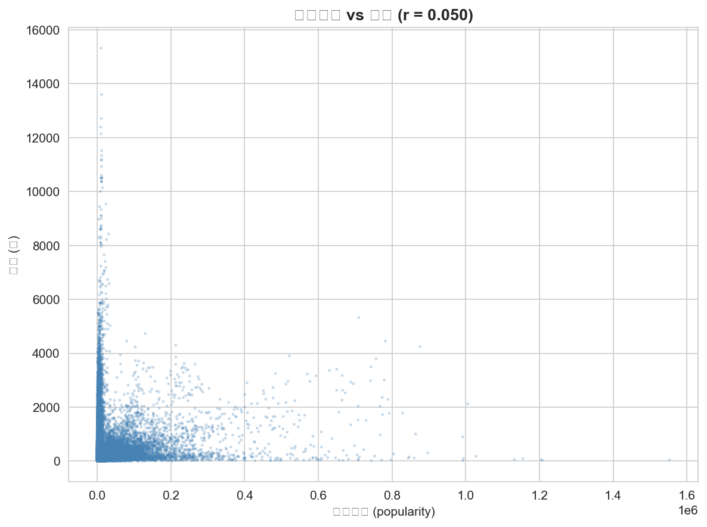
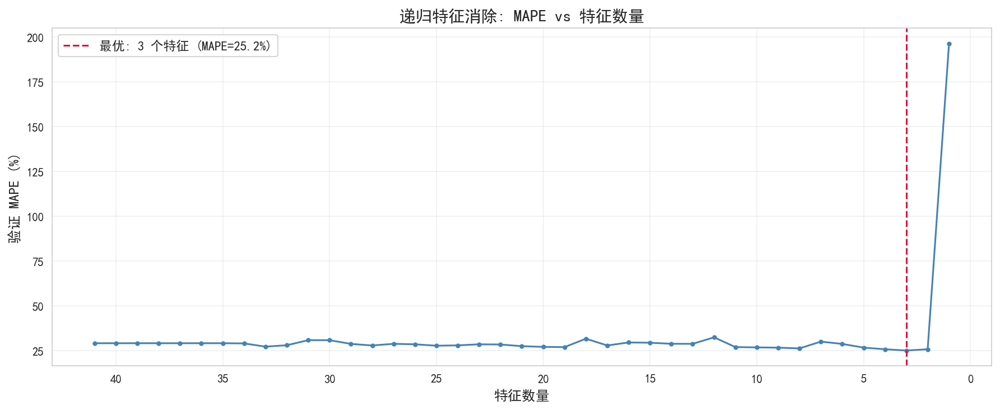

# 🚗 中国乘用车市场销量预测分析

> 基于 43,296 条汽车销量与搜索热度数据，构建 LightGBM 销量预测模型，通过特征工程与模型迭代，将预测误差（MAPE）从 71.22% 降低至 21.85%。

---

## 🎯 项目成果

### 核心指标

| 指标 | 结果 |
|--------|--------|
| 数据规模 | 43,296 条记录 |
| 时间范围 | 2016-2018 |
| 基线模型 MAPE | 71.22% |
| 最优模型 MAPE | **21.85%** |
| 性能提升 | **69.3%** |
| 最终模型 | LightGBM + RFE + Log Transform |

---

## 🌟 项目亮点

✅ 完成汽车销量预测全流程项目

✅ 构建 41 个预测特征并进行特征筛选

✅ 使用 RFE 发现最优特征组合

✅ 通过 Log Transform 显著提升预测稳定性

✅ 输出 2018 年 1-4 月销量预测结果

✅ 从业务角度解释销量变化规律

---

# 📊 核心发现

## 发现1：搜索热度并非通用预测因子

很多业务人员认为：

```text
搜索量越高
↓
销量越高
```

实际分析发现：

- 整体相关系数仅 0.05
- 不同车型差异巨大
- SUV车型相关性明显
- Sedan车型相关性极弱

说明搜索热度不能直接作为统一预测指标。



---

## 发现2：销量惯性远比搜索热度重要

RFE特征选择结果显示：

最重要的三个变量：

1. lag_1（上月销量）
2. month（月度季节性）
3. model_mean（车型平均销量）

最终仅使用 3 个核心特征即可达到较优预测效果。



---

## 发现3：春节效应显著影响销量

月销量趋势显示：

- 每年2月销量明显下降
- 春节期间购车需求减少
- 节后销量快速恢复

说明销量预测必须考虑季节性因素。


---

# 🏗 项目流程

```text
数据质量审计
        ↓
探索性数据分析（EDA）
        ↓
特征工程
        ↓
模型构建
        ↓
特征选择（RFE）
        ↓
模型优化
        ↓
销量预测
```

---

# 🔍 数据质量审计

数据集包含：

- 销量数据（train_sales_data）
- 搜索热度数据（train_search_data）
- 用户画像数据（train_user_reply_data）

审计结果：

✅ 无缺失值

✅ 无重复记录

✅ 时间序列连续完整

✅ 数据关联关系正常

---

# 📈 模型迭代过程

| 模型版本 | 特征数 | 测试集MAPE |
|------------|------------|------------|
| Baseline | 0 | 71.22% |
| LightGBM V1 | 29 | 25.54% |
| LightGBM V2 | 41 | 33.47% |
| RFE筛选 | 3 | 26.63% |
| Log + RFE | 3 | **21.85%** |

### 关键结论

并非特征越多越好。

通过特征筛选和目标变量变换：

- 降低过拟合风险
- 提高模型泛化能力
- 获得最佳预测表现

---

# 🛠 技术栈

### 数据处理

- Python
- Pandas
- NumPy

### 数据可视化

- Matplotlib
- Seaborn

### 机器学习

- LightGBM
- Scikit-Learn
- Recursive Feature Elimination (RFE)

### 开发环境

- Jupyter Notebook

---

# 📁 项目结构

```text
Car_sales
│
├── data
│
├── charts
│
├── notebooks
│   └── analysis.ipynb
│
├── sub.csv
│
└── README.md
```

---

# 📄 项目文件

| 文件 | 说明 |
|--------|--------|
| analysis.ipynb | 完整分析流程 |
| sub.csv | 最终预测结果 |
| charts/ | 项目可视化图表 |
| README.md | 项目说明文档 |

---

# 💼 商业价值

本项目证明：

- 历史销量是最稳定的预测指标
- 搜索热度需要结合车型分析
- 季节性因素对销量影响显著
- 少量高质量特征优于大量低价值特征

相关方法可应用于：

- 汽车销量预测
- 零售需求预测
- 库存管理
- 营销投放优化

---

# 👨‍💻 作者
本人+AI完成：

- 数据清洗
- 探索性分析
- 特征工程
- 模型训练
- 结果分析
- 项目文档编写
