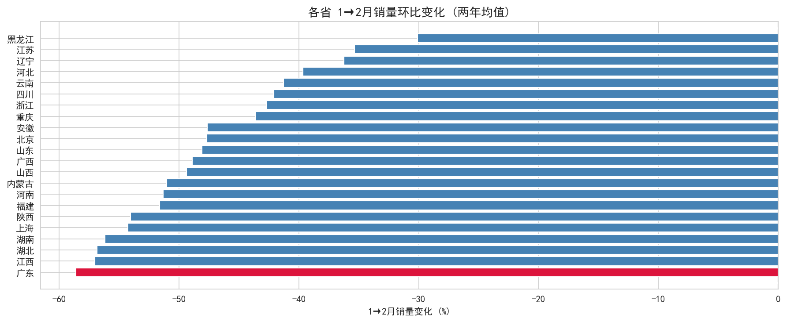
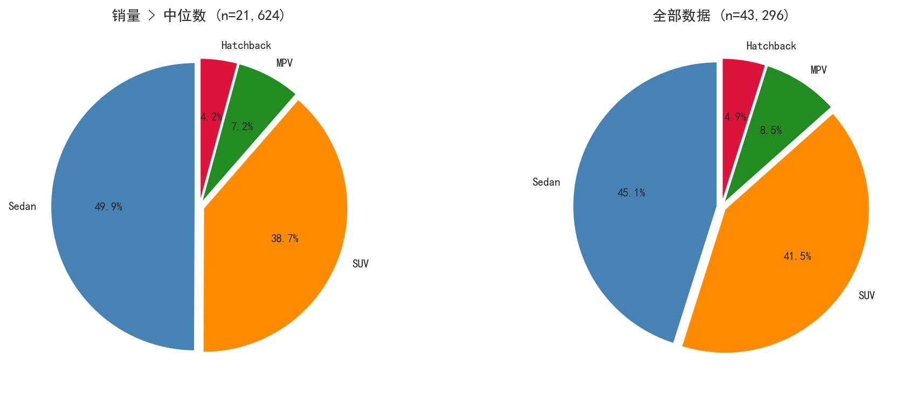
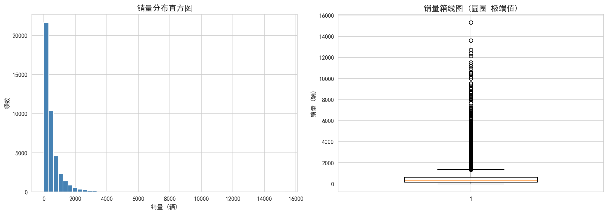

# 🚗 中国乘用车市场销量预测分析

> 基于 43,296 条汽车销量与搜索热度数据，从数据质量审计到迭代预测建模，将预测误差（MAPE）从 71.22% 降低至 21.85%。

---

## 🎯 项目成果

### 核心指标

| 指标 | 结果 |
|--------|--------|
| 数据规模 | 43,296 条销量 + 43,296 条搜索热度 |
| 覆盖范围 | 22 省 × 82 车型 × 4 种车身类型 |
| 时间范围 | 2016-01 ~ 2018-04 |
| 基线模型 MAPE | 71.22%（去年同期抄底） |
| 最优模型 MAPE | **21.85%** |
| 性能提升 | **69.3%** |
| 最终模型 | LightGBM + 3 特征 + 对数变换 |

---

## 🌟 项目亮点

✅ 完成从数据审计到迭代预测的全流程分析

✅ 用卡方检验、四分位数分组等方法验证 bodyType 与销量的统计关联

✅ 分四个维度（横截面、时序、去季节、极端拆解）验证搜索热度对销量的预测能力

✅ 构建 41 个预测特征，通过 RFE 递归特征消除发现最优特征组合仅需 3 个

✅ 对数变换将偏度 4.87 的极端右偏分布拉向正态，MAPE 再降 5 个百分点

✅ 8 轮滚动窗口验证模拟真实预测场景，严格防止用未来信息作弊

✅ 输出 2018 年 1-4 月分省分车型销量预测结果

---

# 📊 核心发现

## 发现 1：搜索热度并非通用预测因子

很多业务人员认为"搜索量高 = 销量高"，实际分析发现：

| 分析维度 | 方法 | 发现 |
|----------|------|------|
| 横截面 | 同一月内，高搜索的车是否卖得更多 | 整体 r = 0.05，一半省份 r 为负 |
| 时序 | 同一款车 24 个月，搜索涨销量是否跟涨 | 14 款车 r > 0.5，11 款 r < 0 |
| 去季节性 | 剥离 12 月冲顶/2 月暴跌的共同规律后 | 36/82 款车去季节后 r 为负 |
| 极端拆解 | r 最高(SUV 某款) vs r 最低(Sedan 某款) | SUV 22 省全正，Sedan 20 省全负 |

**结论**：搜索对 SUV 有效，对成熟 Sedan 无效。搜索热度不能作为统一的通用预测特征。


---

## 发现 2：3 个特征就够了——多特征不如对的特征

RFE 递归特征消除的结果：

从 41 个特征开始，逐轮去掉重要性最低的特征，发现**最优特征数 = 3**：`lag_1`、`month`、`model_mean`。

| 特征数 | 测试 MAPE |
|--------|----------|
| 41 | 33.47% |
| 20 | 32.53% |
| 10 | 34.00% |
| 5 | 27.45% |
| **3** | **26.63%** |

超过 5 个特征后，测试 MAPE 从 27% 跳升至 34%+——**特征越多，过拟合越严重**。


---

## 发现 3：2 月暴跌是全国性春节效应，不是广东的问题

22 省折线图显示 1→2 月销量全线暴跌：

- 2016 年全国均值 -60%+，2017 年大幅改善
- 广东绝对值掉最多仅因 1 月销量基数全国最大，降幅比例低于广西、内蒙古等小基数省份
- 分车型归因：所有 bodyType 都在跌，没有哪个车型能"逆增长"
- 广东 2017 年降幅从 -79% 收窄到 -47%

**结论**：这是全国性春节效应，不是广东独有问题。



---

## 发现 4：Sedan 主导高销量层，SUV 集中在低销量区

将全部记录按销量分 Q1-Q4 四组：

- Sedan 从 Q1 的 38% 上升至 Q4 的 **54%**
- SUV 从 Q1 的 44% 降至 Q4 的 **33%**
- 卡方检验 χ² = 984, p ≈ 0——统计显著

**结论**：Sedan 天然具有更大市场容量，更容易成为高销量爆款。



---

# 🏗 项目流程

```text
数据质量审计（缺失值 / 重复值 / 一致性）
        ↓
探索性数据分析（分布 / 相关性 / 季节性）
        ↓
特征工程（滞后 / 滚动 / 交互 / 编码）
        ↓
Baseline 模型（去年同期抄底）
        ↓
LightGBM V1（29 特征）
        ↓
LightGBM V2（41 特征 + month 编码）
        ↓
RFE 递归特征消除（41 → 3）
        ↓
对数变换 + 3 特征（最优方案）
        ↓
迭代预测 2018 年 1-4 月
```

---

# 🔍 数据质量审计

### 数据集

| 数据集 | 行数 | 时间 | 车型 | 说明 |
|--------|------|------|------|------|
| 初赛销量 | 43,296 | 2016-2017 | 60 | 22 省 × 24 月 |
| 初赛搜索 | 43,296 | 2016-2017 | 60 | 与销量表完美对齐 |
| 复赛销量 | 31,680 | 2016-2017 | 82 | 新增 22 车型 |
| 评估集 | 12,496 | 2018-01~04 | 82 | 待预测 |

### 审计结果

| 检查项 | 结果 |
|--------|------|
| 缺失值 | ✅ 训练集 0 缺失，评估集 forecastVolum 全空符合预期 |
| 重复值 | ✅ 完全重复行 = 0，主键冲突 = 0 |
| 时间连续性 | ✅ 24 个月无断月 |
| 字段规范性 | ✅ bodyType 仅 4 个干净值，无拼写错误 |
| 两表对齐 | ✅ 销量表与搜索表在 5 键上完美对应 |

### 销量分布

| 统计量 | 值 |
|--------|-----|
| 均值 | 533 |
| 中位数 | 308 |
| 偏度 | **4.87**（极端右偏） |

偏度 4.87 意味着少数爆款月销数千台，绝大多数车型-省份组合月销几百台——建模前必须做对数变换。



---

# 📈 模型迭代过程

### 滚动窗口验证策略

```
第1轮: 训练=[2016全年]                   → 验 2017-01
第2轮: 训练=[2016全年 + 2017-01]         → 验 2017-02
...
第8轮: 训练=[2016全年 + 2017-01~07]      → 验 2017-08
                                              ↓
                                         测试: 2017-09~12
```

模拟真实预测场景——绝不能用 3 月数据预测 2 月。

### 五版迭代对比

| 模型版本 | 特征数 | 对数变换 | 验证 MAPE | 测试 MAPE |
|----------|--------|----------|----------|----------|
| Baseline | 0 | 否 | 59.08% | 71.22% |
| LightGBM V1 | 29 | 否 | 66.00% | 25.54% |
| LightGBM V2 | 41 | 否 | 51.99% | 33.47% |
| RFE 筛选 | 3 | 否 | 55.04% | 26.63% |
| **对数 + RFE** | **3** | **是** | **30.97%** | **21.85%** |

### 关键节点

**V1 → V2**：新增 `month` 特征后，2 月 MAPE 从 160% 断崖式降至 56%。模型终于学会了"2 月必跌"。

**V2 → RFE**：41 特征砍到 3 个，测试 MAPE 反而从 33.47% 降至 26.63%。证实 V2 严重过拟合。

**RFE → 对数变换**：y = ln(y+1) 将偏度 4.87 拉向正态，测试 MAPE 再降至 21.85%。这是整个迭代中收益最大的单项优化。

### 最终模型

| 组件 | 配置 |
|------|------|
| 模型 | LightGBM Regressor |
| 特征 | lag_1, month, model_mean |
| 变换 | y_log = ln(salesVolume + 1) |
| 训练数据 | 2016-01 ~ 2017-12 全量 |
| 预测方式 | 逐月迭代：2018-01 用真实 lag，02 用 01 预测值回填，以此类推 |

---

# 🛠 技术栈

### 数据处理
- Python · Pandas · NumPy

### 数据可视化
- Matplotlib · Seaborn

### 机器学习
- LightGBM · Scikit-Learn
- RFE（递归特征消除）

### 统计分析
- 卡方检验 · Pearson 相关系数 · 四分位数分组

### 开发环境
- Jupyter Notebook

---

# 📁 项目结构

```text
Car_sales
├── data/
│   └── raw/
│       ├── preliminary/          # 初赛数据（60 车型）
│       │   ├── train_sales_data.csv
│       │   ├── train_search_data.csv
│       │   └── evaluation_public.csv
│       └── rematch/              # 复赛数据（82 车型）
│           ├── train_sales_data.csv
│           └── evaluation_public.csv
├── charts/                       # 24 张分析图表
├── notebooks/
│   └── analysis.ipynb            # 完整分析 Notebook
├── sub.csv                       # 最终预测结果
└── README.md
```

---

# 📄 项目文件

| 文件 | 说明 |
|------|------|
| [analysis.ipynb](notebooks/analysis.ipynb) | 完整分析流程（64 个 Cell，含数据审计、EDA、特征工程、RFE、迭代预测） （需下载）|
| [sub.csv](sub.csv) | 最终预测结果（id, forecastVolum），共 12,496 条 |
| [charts/](charts/) | 24 张分析图表（销量分布、搜索相关性、省份趋势、特征选择等） |

---

# 💼 商业价值

### 核心洞察

- **历史销量惯性是最稳定的预测指标**——lag_1 始终位列 Top 5 特征
- **搜索热度必须分车型使用**——对 SUV 有效，对 Sedan 无效，不能一刀切
- **季节性因素对销量影响显著**——month 特征让模型 2 月预测从崩溃变为可控
- **少量高质量特征优于大量低价值特征**——3 个特征打平 29 个，超过 41 个

### 方法论可迁移至

- 汽车销量预测 · 零售需求预测 · 库存管理与调配
- 营销投放 ROI 预估 · 新产品冷启动销量预估
- 任何具有强季节性和历史惯性的时序预测场景
